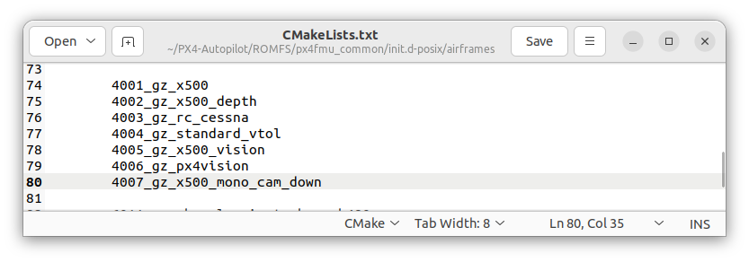

# Dev-MyQuadcopter

Documentation for Create the world of simulation add with aruco + Adding the model pickup to the simulation
Caution: This is only for PX4-Autopilot v1.14. The other version may have another difference. 

Basically, You can actually running the simulation with open the PX4-Autopilot, and run this on the terminal
```javascript
make px4_sitl gz_x500
```
This command run the default.sdf world file and the quadcopter x500 model file.
You can find the world file on path (PX4-Autopilot/Tools/simulation/gz/worlds)
and the model file on path (PX4-Autopilot/Tools/simulation/gz/models)

1. Adding the aruco.sdf, on your world path. Also download the dependencies of the arucotag such png file, model.config and  model.sdf.
Put it down itu one file names aruco. Place it on the worlds file path
```shell
worlds<br/>
   aruco<br/>
      arucotag.png
      model.config
      model.sdf
   aruco.sdf
   default.sdf
```
The world file is already, its time to configure it to your simulation.
Define the parameter on the file airframe configuration file. In my case, i use the x500 quadcopter series.
The parameter file access on path (PX4-Autopilot/ROMFS/px4fmu_common/init.d-posix/airframes/4001_gz_x500)
The default is define in line 11.
```javascript
PX4_SIMULATOR=${PX4_SIMULATOR:=gz}
PX4_GZ_WORLD=${PX4_GZ_WORLD:=aruco}
PX4_SIM_MODEL=${PX4_SIM_MODEL:=x500}
```
change the `default` to `aruco`.
its define the worlds that must execute is the aruco file.
If you want to get another worlds, it can be downloaded through this [here](https://github.com/PX4/PX4-gazebo-models.git)

2. Use the camera monocular on x500 quadcopter (down facing)
This model has a simple monocular camera sensor attached facing down (caution: there is no physical camera visualization on the model itself, no meshes or thumbnail image)
adding to the models to your path PX4-Autopilot (PX4-Autopilot/Tools/simulation/gz/models)
Edit the file again on (PX4-Autopilot/ROMFS/px4fmu_common/init.d-posix/airframes/4001_gz_x500)
```javascript
PX4_SIMULATOR=${PX4_SIMULATOR:=gz}
PX4_GZ_WORLD=${PX4_GZ_WORLD:=aruco}
PX4_SIM_MODEL=${PX4_SIM_MODEL:=x500_mono_cam_down}
```
When you're running the simulation. It called on terminal same as before. `make px4_sitl gz_x500`.
Because, the file that you already edited is in 4001_gz_x500

3. When you want to make the other command on terminal, like `make px4_sitl gz_x500_mono_cam_down` you have to define it on the CmakeList.txt on path (PX4-Autopilot/ROMFS/px4fmu_common/init.d-posix/airframes)
and you have to create a new file on the path (PX4-Autopilot/ROMFS/px4fmu_common/init.d-posix/airframes)

