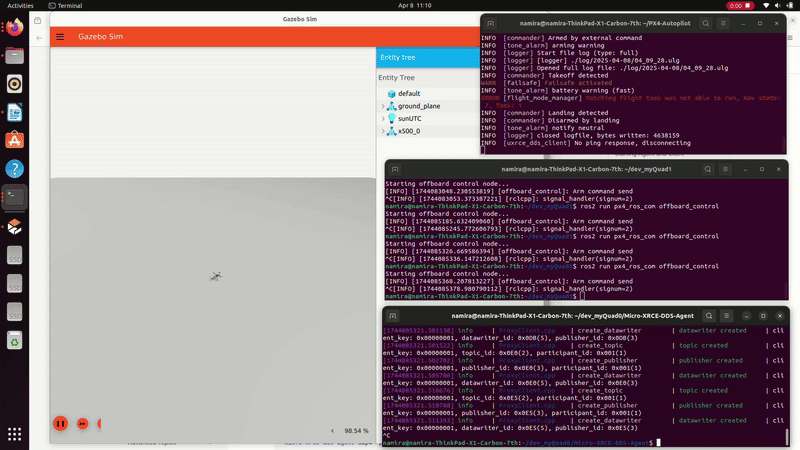

# Dev-MyQuadcopter
Setting up the development of research quadcopter.

Step for testing implementation ros2 offboard control with px4
1. Clone the px4_msgs and px4_ros_com
```javascript
source opt/ros/humble/setup.bash
mkdir my_devQuad1/src
cd my_devQuad1/src
git clone https://github.com/PX4/px4_msgs.git -b release/1.14
# checkout the matching release branch if not using PX4 main.
git clone https://github.com/PX4/px4_ros_com.git -b release/v1.14
```
the new folder has been created again, because before we use the env make the colcon build has not been success
2. Build the source
```shell
cd ..
colcon build
source install/local_setup.bash
```
3. Open your Micro-XRCE-DDS Agent (New Terminal)
```shell
cd dev_myQuad0/Micro-XRCE-DDS-Agent
MicroXRCEAgent udp4 -p 8888
```
4. Running the offboard control programs (back to the terminal step number 2)
```shell
ros2 run px4_ros_com offboard_control
```


This command, execute the px4_ros_com package, and offboard_control from src/examples/offboard/offboard_control.cpp

#
If you want to program with python, and execute that. Not use the c++ file. We can also declare it first.
when you clone the px4_ros_com you also have multiple file example on ```/src/examples``` folder.
you will have the `offboard` and ```offboard_py``` file. Offboard have the c++ file and offboard_py have the python file. 

1. This package is c++, there is no setup.py
add this on the top of the offboard_control.py
```shell
#!/usr/bin/env python3
```
This make your python script has a shebag and executable permission. Then run this on your terminal
```shell
chmod +x /src/examples/offboard_py/offboard_control.py
```
shebag and chmod +x is needed to anticipate the permission error like
```shell
bash: ./offboard_control.py: Permission denied
```
this command on terminal make allowed to run as an executable. This is running enough one time.
2. Modify CMakeList.txt
Add to the cmakelist
```shell
# Install Python scripts
install(PROGRAMS
  scripts/my_python_node.py
  DESTINATION lib/${PROJECT_NAME}
  RENAME py_offboard
)
```
3. Modify package.xml
```shell
<exec_depend>rclpy</exec_depend>
<exec_depend>python3</exec_depend>
```
4. Rebuild and source
```shell
colcon build --packages-select px4_ros_com
source install/local_setup.bash
```
5. Run it
```shell
ros2 run px4_ros_com py_offboard
```
